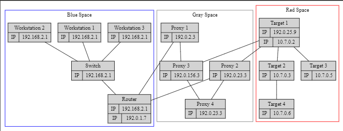

# NetWorm

NetWorm is currently a project I'm working on. The goal is a networking library written in rust that is able to handle the mapping, visualizataion, and navigation of complex networks. Differentiation between, physical and virtual machines to give a comprehensive view of a network. Potentially later expanding into a C2 framework for cybersecurity.

Below is an example of the graphs that this program is intended to produce from provided input. This inpuit can be from multiple sources (text files, data gathered through parsed nmap commands maybe, a GUI if I get *really* bored)

